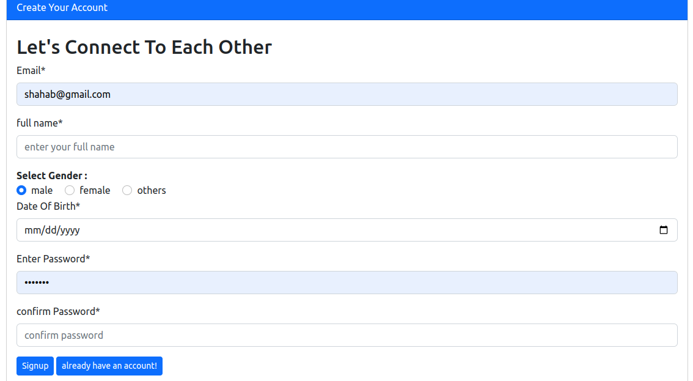
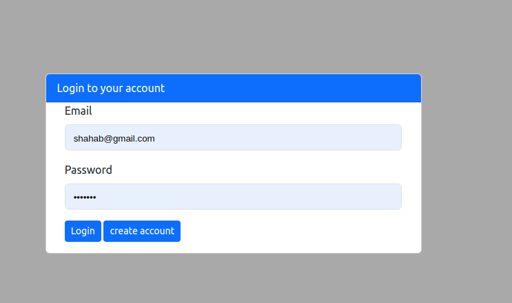
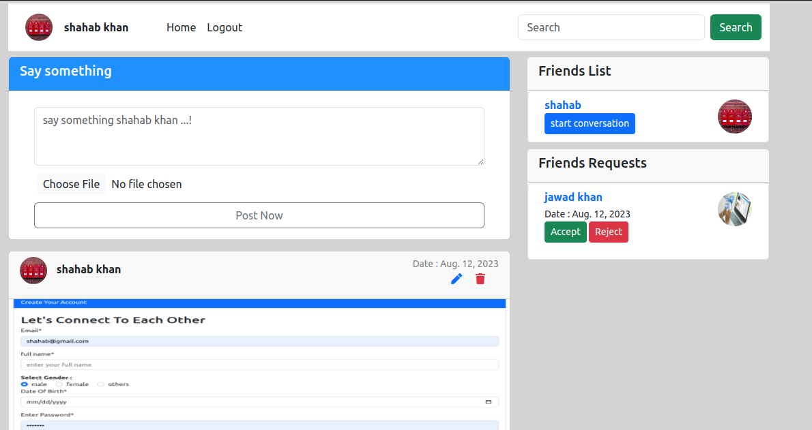

# social networking project django, django channels, Celery and javascript

This is a social networking project for user to interact with each other by sending friend invitation, upload posts, hit a like on each other post, start conversation with each other.

# how to use this project

1 - create account by entering a unique email, valid name , and password

2 - after the creation of account an email will be set to the user to activate the account.

3 - after account activation user logged-in to their profile, and from their user can update their profile picture, upload post, like posts, send friend requests to other user, accept friend request which was send by other users, and start conversation with each other.

# Requirements
1: python version >= 3.0

2: django version >= 4.0

# How to run this project

step 1: download the project

step 2: create a virtual environment with "virtualenv myenv" command ------> this is for ubuntu

step 3: activate your virtual env by " source myenv/bin/activate " --------> this command is for ubuntu users

step 4: change directory to the project folder

step 5: pip install -r requirements.txt

step 6: python manage.py makemigrations

step 7: python manage.py migrate

step 8: python manage.py runserver

# screenshots 

Registration page  

Login Page 

profile Page

Chat page

